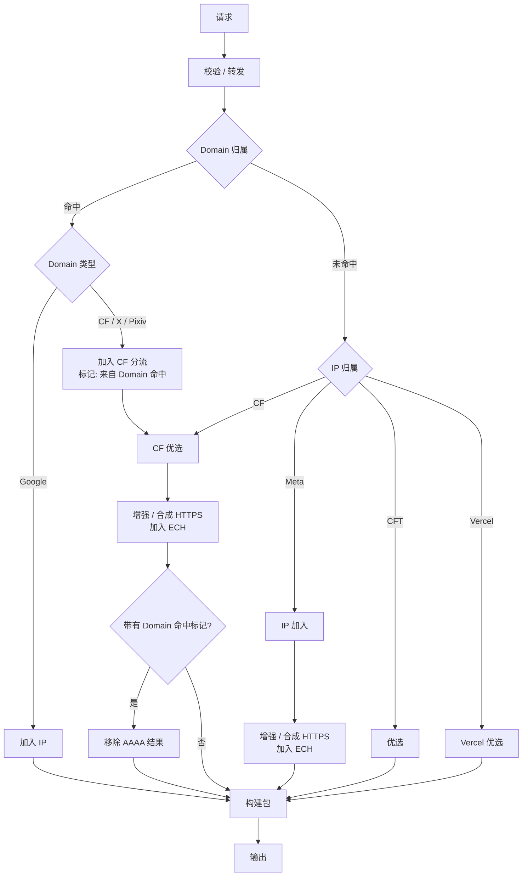

# SuperDoH-RS 需求草稿

> 状态:**收集口述中**(用户逐条口述,本文件实时更新)。需求条目以"已确认"为准,未确认的不写入。

---

## 需求清单

### R1. 前端像素级复刻(已确认)

- 原项目 `frontend/`(index.html、en.html、css/style.css、js/resolver.js、js/config-wizard.js)**逐字节复用,零修改**
- 构建时打包进 Worker(替代 JS 版 `src/templates.js` 内嵌机制)
- 首页动态注入逻辑保留(`__HOST__`、`__UPSTREAM_LIST__`、`__CONFIGURED_VALUE__` 等占位符替换),在 Rust 侧实现
- 配置向导(config-wizard.js)为纯浏览器端逻辑,可直接复用

### R2. 配置方式与原版一致(已确认)

- 配置源:仓库根目录 `superdoh.config.js`(JS 格式 `export default`,唯一人类可编辑源)
- 构建流程:`npm run build`(构建脚本)→ 读取配置 → 生成 **Rust 版 config**(对应原版 `src/config.js` → `src/config.rs`)
- 构建时远程抓取:GeoIP CIDR(8 类)、Cealing-Host Google 代理列表
- `configured: 0/1` 双模式语义保留(0=首次配置模式,1=正式运行)

### R3. 地区优化流程(用户提供 flowchart,已确认)

**流程要点(理解确认)**:

1. **Domain 归属优先于 IP 归属**:域名命中规则(remap 列表 / Google 代理规则 / Meta 域名规则)时不再做 IP 分类(Q21:Domain 分类补齐 Meta)
2. **Domain 命中的 CF/X/Pixiv**(remap)→ 走 CF 分流(优选)+ **打"来自 Domain 命中"标记**
3. **Domain 未命中** → 按响应 IP 归属分类:CF → CF 优选;Meta → **mix 二次解析后 IP 加入**;CFT → 优选;Vercel → Vercel 优选
4. **CF 优选与 Meta IP 都进入 HTTPS 增强 / 合成 + ECH**(CF 动态 ECH / Meta 静态 ECH):已有兼容 ServiceMode RR 时安全修改;没有 HTTPS RR 时允许在满足 HTTPS 合成条件后生成完整、合法的 ServiceMode HTTPS RR
5. **"来自 Domain 命中"标记** → 构建包前**移除 AAAA 结果**(remap 域名屏蔽 v6)
6. Google → 代理 IP 直接加入,不经过 ECH
7. 所有路径汇聚 → 构建包 → 输出

**与原版 JS 实现的对应关系**:

| flowchart 节点 | 原版实现 |
|---|---|
| Domain 归属 | `isCFDomain`(remap)/ `isMetaDomain` / `matchGoogleProxy` |
| IP 归属 | `classifyResponse` / `detectOwner`(GeoIP CIDR) |
| CF 优选 | `preferredAnswer`(解析 preferredCf) |
| CFT / Vercel 优选 | `preferredAnswer`(preferredCft / preferredVrc) |
| Meta IP 加入 | `metaResolve`(静态路由 + 收集)→ 新版:**mix 二次解析**(收集更多 Meta IP)+ IP 加入;Meta AAAA 正常增强(A/AAAA 对等,Q20) |
| HTTPS 增强 / 合成 + ECH | `injectECH`(CF 动态 / Meta 静态);新版扩展为已有 RR 安全修改 + 无 RR 时条件合成 |
| 移除 AAAA | 原版为 remap 域名 AAAA 提前拦截 NODATA |

**待确认差异点**:原版在请求入口提前拦截 remap AAAA;流程图改为"构建包前移除"。语义等价(remap 域名最终无 AAAA),Rust 版实现位置待定(可两者取一)。

**与原版整体对比**:除上游查询/竞速部分外,地区优化流程与原版 `autoFlow` 逻辑类似。上游查询与竞速机制**由用户重新设计**(非简单沿用/移除),见 R4。

### R4. 上游竞速(fast,原 mix)— 用户重新设计(已确认)

原 AUTO 1 竞速阶段,重新设计并**改名为 `fast`(曾暂名 mix)**:

- **单纯竞速**:所有上游并发查询,谁先返回有效结果用谁——**无 ECS 保护窗、无暂存、无排序**(原版 `ecsProtectMs` 保护窗逻辑删除)
- **硬超时 200ms**:超时后无有效结果的处理逻辑待定(原版:servfail + EDE 22;原定 800ms 已改为 200ms)
- **ECS/EDNS 不区分优先级**:不再区分 ECS 上游/非 ECS 上游的响应优先级
- **能使用 EDNS 的就用**:支持 ECS 的上游(`ecs: true`)注入 EDNS Client Subnet,不支持的就不注入(注入与否按上游能力)
- 竞速结果交给地区优化流程(R3)做归属判断

**已裁决(2026-08-03)**:
- `/dns-query` 为唯一 DoH 端点(单上游端点已删除,Q8);常量命名按 fast 语义(如 `FAST_PROVIDER = 'fast'`,实现层决定)
- ECS 注入策略按 RFC 正确实现:仅 ecs:true 上游携带 ECS;请求自带 ECS 不重复注入、不扩大前缀、处理 /0(Q23)

### R5. fast 与 mix 算法定位(已确认,含用户澄清)

**fast 与 mix 都是算法(解析环节的查询策略),不是流程。后续的分流 / 命中 / ECH 注入 / 构建包等不属于它们,由 R3 地区优化流程处理。**

| 算法 | 语义 | 适用场景 |
|---|---|---|
| **fast** | 并发竞速:**先回有效者胜**(原 AUTO 1 竞速重新设计) | 抢速度——只需要一个答案 |
| **mix** | **收集更多 IP**:并发查询多个上游,聚合/去重所有结果 IP(对应原版 `resolvePreferred` 的收集语义) | 需要多个候选 IP |

**算法调用点(全部为 fast)**:

- **主查询**(R4):fast 竞速拿原始答案 → 交给 R3 做归属判断
- **优选域名解析**(R3 中 CF/CFT/Vercel 优选节点):解析 `preferredCf` / `preferredCft` / `preferredVrc` 时使用 **fast**
  - 原版对应:`resolvePreferred`(并发 foreign 上游收集 IP,300ms 超时,按 expectedOwner 过滤)
  - **替换语义(已确认)**:优选解析得到的结果 IP **替换**原先解析结果中的 IP(原版 `preferredAnswer` 用 `buildDNS` 重建响应、TTL 60;不是追加/合并)
- **CF ECH 获取**(R3 中"加入 ECH"节点的 CF 动态 ECH):查询 `cloudflare-ech.com` 的 HTTPS RR 使用 **fast**
  - 原版对应:`fetchCFEch`(顺序尝试前 3 个上游,10 分钟缓存 + 1 小时 stale 兜底)
  - 缓存 / stale 降级策略是否保留待定

**mix 算法(已定义,调用点已指定)**:
- **语义**:向多个 DNS 厂商(上游)发送请求,收集所有返回结果并**合并去重**,获取尽可能多的 IP(Q18:mix 为纯算法,只做并发查询→收集→合并→去重,不含任何过滤/归属判断)
- **硬超时 200ms**(与 fast 一致)
- **调用点**:R3 流程中 **Meta IP 归属确认后**的二次解析——位于"IP 归属判定为 Meta"之后、"IP 加入"之前(即 mix 收集到的 Meta IP 供 IP 加入使用)
  - 对应 R3 流程:`G{IP 归属} →|Meta| [mix 二次解析] → I[IP 加入]`
  - 原版对应:`metaResolve`(800ms 硬超时 + 50ms 收集窗 + 静态路由表 merge)
  - **待澄清**:静态路由表(meta-route.js)是否保留与 mix 结果合并?

**已裁决(2026-08-03)**:
- expectedOwner 过滤:由调用方提供(接受 Q16:fast 提供通用 accept/validator 回调,业务验收条件由策略层传入,不进算法)
- CF ECH 缓存 10min + 1h stale:保留(Q10 #9,CF ECH 缓存 10min + 1h stale 保留);失效策略可配置(Q22)
- mix 调用点:Meta 归属确认后二次解析(已确认)

---

## Review 问题清单(2026-08-03 添加,待用户逐块回答)

> 模拟构建结论:R3 核心流程逻辑自洽可走通;存在 1 个阻塞性冲突、2 个流程缺失、1 个语义未定义,以及参数缺失若干。以下逐块列出,回答后逐块标记 ✅。

### Q1. 前端字段冲突 ✅ 已回答(2026-08-03)

**回答:选项 ①——字段原样保留**(死参数兼容前端)。

config-wizard.js 固定生成的全部字段(`autoConcurrency`、`ecsProtectMs`、`hardTimeoutMs`、`metaHardTimeoutMs`、`metaCollectWindowMs`、`metaMaxIps`、`preferredTimeoutMs`)在配置中**原样保留**(即使部分在新版流程中已无实际作用);`/config.json` 按前端契约返回全字段。前端零改动。

### Q2. ECH 注入 / HTTPS 合成触发条件 ✅ 已回答;2026-08-05 修订

**最新裁决:去掉“必须已有 HTTPS RR”限制。**流程走到 HTTPS 增强节点时:

1. **已有兼容 ServiceMode HTTPS(65) RR** → 在原 RR 上安全增强:保留可兼容参数,按地址策略同步处理 hints,加入/替换 ECH。
2. **没有兼容 ServiceMode HTTPS RR**(包括标准 HTTPS NODATA) → 不再直接跳过;当 owner 能被明确证明且该 owner 有可靠 ECH 来源时,允许**合成完整、合法、可用的 ServiceMode HTTPS RR**。
3. **NXDOMAIN 永不复活**;无法明确 owner、ECH 来源不可用、记录语义无法安全构造时均 fail-open,返回原始结果。
4. 该能力属于地区优化 / ECH 策略;`configured:0`、`regions` 为空或未命中地区时仍不合成。

“尽力 ECH”因此定义为:**能安全增强就增强;缺少 HTTPS RR 时能安全构造就构造;无法确认则保持原 DNS 语义。**

### Q2b. 设计原则:模仿正常 DNS 分发服务(已确认)

**本项目涉及对 DNS 结果的修改操作(替换 IP / 注入 ECH / 移除 AAAA 等),因此整个服务必须表现得像一个正常的、标准的 DNS 分发服务**——协议行为、响应格式、错误语义均符合标准 DNS/DoH 规范,不暴露代理/优化痕迹。

具体含义(待细化):
- DNS wire format 正确性(RFC 8484 等),响应结构规范
- 标准状态码与 RCODE 语义(如 NODATA / NXDOMAIN / SERVFAIL + EDE)
- 不泄露代理特征(响应头、行为指纹等)
- TTL 合理性、EDNS/DO 位处理等符合正常解析器行为
- (细节待用户补充)

### Q3. 非 A/AAAA 查询路径 ✅ 已回答

**回答:非 A/AAAA 与 A/AAAA 走完全一样的流程、一样的优化**(统一走 R3 地区优化流程,不做区分)。即 HTTPS(65)查询同样经过 Domain/IP 归属判定 → 优选/替换 → HTTPS 增强或条件合成 → 加入 ECH。

### Q4. Google 分支语义 ✅ 已回答

**回答:合并 + Happy Eyeballs**——Cealing-Host 代理 IP 优先 + 真实 IP 兜底合并(与原版一致;代理 IP 排前,浏览器 Happy Eyeballs 先试代理)。

### Q5. fast 200ms 风险确认 ✅ 已回答

**回答:维持 200ms,参数可调**(做成配置项)。

### Q6. mix 结果 Meta 过滤 ✅ 已回答

**回答:不用**。设计原则:**算法与策略分离**——mix 是纯算法(收集合并去重),不含 Meta 过滤等策略;过滤属策略层,当前策略层也不做。

### Q7. 参数缺失清单(待精简重问,2026-08-03)

> 原 12 项过长,已精简为默认值确认表(见下方"参数默认值确认"节)。

### Q8. 端点与功能保留确认 ✅ 已回答

**回答:`/:provider/dns-query`(单上游直连)不保留,删除;其余全保留**——`/health`、`/config.json`、伪装入口(ENTRANCE+PROXY)、Chrome DoH canary、Meta 静态路由表(meta-route.js,与 mix 结果合并)。

### Q9. 无地区配置路径 ✅ 已回答

**回答:对**——configured:0 / regions 为空 / 非 CN 地区时:fast 竞速后直接返回(不做归属/优选/ECH 优化)。

### Q10. 参数默认值确认(2026-08-03 已回答,含待确认项)

| # | 参数 | 新版结论 |
|---|---|---|
| 1 | fast 并发上游数 | **与 #2 合并**(详见下方待确认) |
| 2 | mix 并发上游数 | **与 #1 合并**——fast/mix 共用一个并发参数(如沿用 `autoConcurrency`) |
| 3 | mix 合并去重后 IP 上限 | **无限制**(收集到的去重 IP 全部保留;原 metaMaxIps 概念废弃) |
| 4 | mix 结果 TTL | 300(默认) |
| 5 | 优选替换 TTL | 60(默认) |
| 6 | IP 黑名单 blockedCidrs | 保留(默认) |
| 7 | ECS 前缀 | 24 / 56(默认) |
| 8 | 超时后返回 | SERVFAIL + EDE 22(默认) |
| 9 | CF ECH 缓存 | 10min + 1h stale(默认) |
| 10 | 日志 | logLevel 结构化 JSON(默认) |
| 11 | configured:0 默认上游 | google + cloudflare_Public(默认) |
| 12 | mix 二次解析查询类型 | **合并(含义待确认,见下)** |

**全局原则(已确认):所有参数均可配置(可调),不硬编码。**

**"12参数合并"读法确认(2026-08-03)**:**读法 A**——第 1、2 项(fast/mix 并发数)合并为一个参数,fast 与 mix 共用同一并发配置(如沿用 `autoConcurrency` 命名,默认 6)。

| # | 参数 | 新版结论 |
|---|---|---|
| 12 | mix 二次解析查询类型 | 跟随原请求类型(A 查 A、AAAA 查 AAAA)(默认,未修改)

---

## 设计分层总原则(2026-08-03 用户裁决)

1. **算法层**:fast / mix 是算法,不承载 CDN、Meta、ECH、过滤等业务策略
2. **策略层**:Domain/IP 归属、优选、IP 加入、ECH、remap AAAA 属于策略
3. **协议/实现层**:DNSSEC、EDNS、RCODE、wire format、TTL 边界、连接取消属协议/实现
4. 不因原版 JS 存在某个策略就默认新版必须继承
5. 协议正确性和 Rust 实现细节自行采用正确实现,不再逐项确认
6. 只有改变实际产品行为或已确认优化策略时,才提出需求问题

---
## 二次 Review 问题清单(2026-08-03,全部裁决完毕)

### Q11. "所有 QTYPE 一样优化"在 wire format 上不成立(🔴 阻塞)

HTTPS(65)查询:fast 返回 HTTPS RR 无 A/AAAA Answer(IP 只在 ipv4hint/ipv6hint);Meta 静态路由是 IPv4,不能直接作为 type 65 RDATA;Google 代理 IPv4 不能加入 AAAA/HTTPS/TXT;TXT/MX 用优选域名同类型替换语义错误。

**建议**:同一编排、类型适配——A/AAAA 替换 RR;HTTPS 保留 RRset 只改 hints/ECH;其他 QTYPE 原样返回。

**裁决**:"所有 QTYPE 一样的流程"指**统一编排流程**,不代表把同一种 RDATA 修改方式硬套给所有类型。按 QTYPE 正确处理 wire format:A 处理 A,AAAA 处理 AAAA,HTTPS 处理 HTTPS RR 内可修改的字段。其他 QTYPE 仍经过统一流程,没有适用优化动作时自然 no-op。**不要因类型不同拆成完全独立的业务流程**。

### Q12. fast"第一个有效结果"无法正确处理正/负响应(🔴 阻塞)

上游 A 25ms 返回 NXDOMAIN/NODATA,上游 B 40ms 返回正常答案:负响应算"有效"则 A 错误压过 B;不算则真实不存在的域名拖到 200ms 变 SERVFAIL。NOERROR+ANCOUNT=0 还可能是 NODATA/referral/异常空响应。

**建议**:fast 三态验证(positive/negative/invalid);第一个语义完整 positive 立即胜出;最早标准负响应暂存,无 positive 时兜底返回(这是 DNS 正确性要求,不是 ECS 保护窗)。

**裁决**:**同意区分 positive / negative / invalid**。首个有效 positive 胜出;标准 negative 可以暂存;最终没有 positive 时返回有效 negative。这是 fast 的**通用响应有效性处理,不是 ECS 保护窗**。

### Q13. 修改 DNSSEC 签名数据与 Q2b 不兼容(🔴 阻塞)

替换 A/AAAA、改 hints、注入 ECH 后原 RRSIG 必然无效;清 AD/删 RRSIG 不能让严格验证客户端接受;合成响应丢失客户端 OPT 违反 RFC 6891;强制向上游设 DO 再透传也不透明。原版 README 已承认验证客户端会丢弃修改响应。

**建议**:记录原始客户端 DO/CD——客户端请求 DNSSEC 时绕过所有内容修改原样返回;非验证客户端策略模式可清 AD/删对应 RRSIG,但明示非透明代理;内部 side query 独立 DO,最终响应按客户端 EDNS 能力重建。

**裁决**:**DNSSEC 必须支持,不能因为客户端请求 DNSSEC 就直接绕过整个优化流程**。正确支持 DO/CD/OPT、DNSKEY、DS、RRSIG 等 DNSSEC 语义,并可验证原始上游响应。如果某个 RRset 被修改/替换/合成,原权威 RRSIG 已失效:删除对应无效 RRSIG,清除不能再成立的 AD 状态,不伪造 Secure。未修改的数据正常保留 DNSSEC 数据。目标是完整支持 DNSSEC 协议与验证能力;不是要求修改第三方数据后还能用第三方权威私钥完成端到端签名验证。

### Q14. "构建前移除 AAAA"与入口 NODATA 不等价(🔴 阻塞)

remap 域名 AAAA 响应含 `alias.example CNAME target.example` + `target.example AAAA 2001:...`:只删 AAAA 留下 CNAME,客户端继续查 target AAAA 仍走 v6。草稿"语义等价"不成立。

**建议**:强制禁用 remap v6 就继续入口返回策略 NODATA(补 SOA/负 TTL);普通优选保留 CNAME 链只替换终端 owner 地址 RRset;不要"遍历删所有 AAAA 后原样返回"。

**裁决**:remap Domain 命中的 AAAA 最终语义**必须 NODATA**。如果"构建前删除 AAAA"会因 CNAME 链产生绕过,实现允许改为更早短路。这里保持的是**产品语义,不强制具体代码执行位置**。

### Q15. Domain 规则可能把 NXDOMAIN/NODATA"复活"为正答案(🟡 高)

nonexistent.facebook.com 命中 Meta 后缀但上游返回 NXDOMAIN,若仍进 mix/静态路由会为不存在的名称合成地址。原版仅非零 RCODE 提前返回,NODATA 仍可能继续。

**建议**:只有主查询得到与 QTYPE 匹配的语义正答案才执行地址优化;NXDOMAIN/NODATA 一律保留。

**裁决(2026-08-05 修订)**:一般规则仍为 **NXDOMAIN/NODATA 不得被 Domain 命中、mix 或静态 IP 随意“复活”**;但增加一个严格限定的 **HTTPS NODATA 合成例外**:

- **NXDOMAIN 永远保持 NXDOMAIN**,任何策略不得合成。
- A/AAAA/其他 QTYPE 的 NODATA 仍保持 NODATA。
- 仅当原请求为 **HTTPS(65)**、名称存在但没有兼容 ServiceMode RR、owner 有明确证据且有可靠 ECH 来源时,策略层可把 HTTPS NODATA 转为合成的正 HTTPS RR。
- 合成前若原负响应含 SOA / NSEC / NSEC3 / RRSIG 等“HTTPS 不存在”证明,最终响应不得保留与新正 RRset 矛盾的否定证明;必须清 AD,删除失效签名/否定证明并按客户端 OPT/DO/CD 正确重建。

### Q16. preferred 与 CF ECH 需在 fast 胜出前执行专用验收(🟡 高)

preferred 最快响应含非 CF IP、cloudflare-ech.com 最快响应只有 alpn 无 ech 参数——generic fast 胜出 abort 后,专用检查失败只能回退原结果。

**建议**:fast 接受调用方 `accept(payload)` 谓词:preferred 要求 IP 属 expectedOwner;CF ECH 要求含 key 5 ech;main 用完整正/负语义。验收失败只退出该 racer 不终止竞速。

**裁决**:fast 提供**通用 accept/validator 回调**。这是算法层的通用结果验收接口,**不允许在 fast 内硬编码 CF、Meta、ECH 等业务知识**。具体调用方自行提供验收条件。

### Q17. 按"第一个命中的 IP"分类破坏多 CDN/混合 RRset(🟡 高)

A RRset 同时含 CF/CFT/未知地址时,原版 classifyResponse 遇到第一个已知 owner 即返回,后续把整个 RRset 替换成该 CDN 优选 IP,丢多 CDN 容灾且行为随记录顺序波动。

**建议**:仅当所有可用地址归属一致才执行 IP 归属优化;混合/未知直接返回原答案(Domain 强制规则可例外)。

**裁决**:自动 IP 归属判断遇到**混合 owner / 无法明确 owner 时,默认不做基于 IP owner 的整体替换**。Domain 明确命中的强制规则不受此限制。

### Q18. mix 不做过滤会把污染/黑名单地址加入答案(🟡 高)

mix 其他上游返回劫持地址/广告拦截地址/DNS64 地址/非 Meta IP 时,因"策略层也不过滤"全部进 RRset;blockedCidrs 若只用于 main fast 会被 mix/preferred/Google 代理/静态表绕过。

**建议**:mix 保持纯算法,但"IP 加入"策略层统一执行 family 校验/blockedCidrs/可路由性/去重;推荐恢复 Meta owner 过滤(不违反算法与策略分离);无安全候选时回退。

**裁决**:不要再把 mix 和 Meta 过滤绑定。mix 是纯算法,只负责:**并发查询 → 收集 → 合并 → 去重**。mix 不知道 Meta、CF、blockedCidrs,也不知道调用前后流程。family、blockedCidrs、owner 等业务检查由**调用 mix 的策略层负责,绝不能写进 mix 算法本身**。

### Q19. HTTPS hints / AliasMode / mandatory / ECH 需联动处理(🟡 高)

priority 0 AliasMode 记录注入 ECH 无效(客户端忽略 SvcParams);原始 ipv6hint 可绕过 AAAA 屏蔽、ipv4hint 可绕过 preferred 替换;删 hint 不更新 mandatory 使记录不兼容;同一 ECHConfig 不能无条件注入多 CDN 每条 ServiceMode 记录。

**建议**:AliasMode 只跟随目标不添参数;只改兼容的 ServiceMode 记录;替换 A/AAAA 时同步重写/移除对应 hints 并更新 mandatory;保留未知 SvcParam/顺序,解析失败原样返回。

**裁决(2026-08-05 修订)**:HTTPS RR 按 DNS/SVCB/HTTPS 规范正确处理 AliasMode、ServiceMode、mandatory、hints、ECH。**不允许为了优化生成非法 RR**。同时允许在 Q2 的 HTTPS 合成条件成立时，从无兼容 ServiceMode RR 的响应中构造新的 ServiceMode RR，规则如下:

- **AliasMode 不直接塞 SvcParams**;若响应存在 CNAME/Alias 链,先确定最终有效 owner/target,合成 RR 必须放在协议上允许承载 ServiceMode 的名称上,不得与 CNAME 所在 owner 冲突。
- 合成记录默认 `SvcPriority=1`、`TargetName=.`;`.` 的有效目标即该 RR owner。
- `ech` 只来自已验证的 owner 对应来源(CF 动态 / Meta 映射),不得跨 owner 复用。
- **不凭空宣称未知能力**:没有可信来源时不伪造 `alpn`、`port`、`no-default-alpn` 或未知 SvcParam。无 `alpn` 时按 HTTPS/SVCB 标准默认 ALPN 语义处理。
- 合成 RR 默认**不携带 `ipv4hint` / `ipv6hint`**;地址继续由 SuperDoH 的 A/AAAA 地区优化路径提供,避免 hints 绕过 preferred/remap 策略。若未来要写入 hints,必须来自同一轮已确认的优化地址并遵守对应 AAAA 屏蔽策略。
- `mandatory` 仅在真实需要时生成,且必须与实际存在的 SvcParam 完全一致;不得出现空 mandatory 或引用不存在 key。
- 无法构造自洽 ServiceMode 时 fail-open / 保留原数据。

### Q20. Meta AAAA 跟随类型缺"可达性"依据(🟡 高)

mix 跟随原类型收集公共 Meta IPv6 会恢复原版刻意禁用的 v6,而这些地址无"中国可达"验证。

**建议**:默认保留 Meta AAAA NODATA(直到有验证过的 v6 静态池);或返回 main fast 原 AAAA 不增强;不要用公共 mix AAAA 作"可达地址"。

**裁决**:**Meta AAAA 正常增强,不沿用原版"Meta AAAA NODATA"限制**。继续已确认规则:A 请求 → mix A → 收集 IPv4;AAAA 请求 → mix AAAA → 收集 IPv6。A/AAAA 对等支持。remap Domain 的 AAAA 屏蔽是另一项独立策略,**不得扩展到普通 Meta AAAA**。

### Q21. Meta Domain 分支与 ECH owner 范围矛盾(🟡 高)

Domain 对照表含 isMetaDomain,但流程图 Domain 类型只有 Google 和 CF/X/Pixiv——Meta HTTPS 无普通 IP Answer 时无法进 Meta 分支;且 Q3"所有类型→加入 ECH"与流程图只有 CF/Meta 进 ECH 冲突(CFT/Vercel/UNKNOWN 无 ECH 来源)。

**建议(历史)**:明确 Domain 分支为 Google/CF-remap/Meta/unmatched;ECH 仅 region.ech=true 且 owner 为 CF/Meta 且有兼容 ServiceMode 记录;CFT/Vercel/UNKNOWN 跳过。

**裁决(2026-08-05 补充)**:**Domain 分类补齐 Meta**。Domain 命中 Meta 时进入 Meta 对应策略。ECH/HTTPS 合成仍只对有可靠 ECH 来源的 owner 执行,不能理解成“所有 QTYPE / 所有 owner 都强行注入 ECH”。

对于 **HTTPS 响应无 ServiceMode/hints** 且 Domain 规则未直接确定 owner 的情况,为支持完整 HTTPS 合成,允许策略层进行**专用 side A/AAAA owner probe**:

- side probe 只用于 HTTPS 合成的 owner 证明与地址事实获取,不是 fast/mix 算法的一部分,也不得递归触发 HTTPS 合成。
- A/AAAA 结果必须得到单一、明确 owner;混合 owner、未知 owner、查询失败均不合成。
- Domain 明确命中(remap/Meta 映射等)时不需要 side probe。
- CFT/Vercel/UNKNOWN 当前没有 ECH 来源,即使 probe 能分类也不为 ECH 目的合成 HTTPS RR。

**合成 TTL 补充(2026-08-05)**:

- CF 合成 HTTPS RR TTL 上限 **60s**,且不得超过当前动态 ECHConfig 的有效期/stale 截止时间。
- Meta 合成 HTTPS RR TTL 上限 **300s**,受静态 ECH 映射自身维护/失效策略约束。
- 合成 HTTPS RR 不得比其关键 ECH/地址依据缓存得更久;有效期无法可靠确定时取更短 TTL。

### Q22. Meta 静态 ECH 不能安全注入所有 Meta 后缀(🟡 高)

ECHConfig 与服务器集群/public_name 绑定,isMetaDomain 命中不代表该 origin 接受同一组 config(交接文档已警告)。

**建议**:按域名服务类别维护"已验证域名 → ECHConfig 子集"映射;未知类别跳过;记录验证时间;CF 动态缓存取 min(配置上限, HTTPS RR TTL);stale 仅作可配置降级;加 single-flight 防并发 cache miss。

**裁决**:Meta 静态 ECH 的适用范围保持为**独立策略配置**。不要把"某域名属于 Meta"与"它一定接受同一份 ECHConfig"视为同一件事。具体 ECHConfig 与域名的映射做成**可配置/可维护数据,不写死进通用算法**。

### Q23. ECS 继承、/0 opt-out 与最终响应归一化未定义(🟡 高)

客户端自带 ECS /0 或短前缀时按 ecs:true 再注入会扩大 SOURCE PREFIX-LENGTH(违反 RFC 7871);重复 ECS 形成非法 OPT;ecs:false 是否剥离客户端 ECS 不清;客户端未发 ECS 时响应不应暴露 Worker 合成 ECS。

**建议**:先保存原始 OPT/ECS;ecs:true 已有则保留或缩短绝不扩大,/0 不改写,没有才合成;ecs:false 明确是否剥离;最终响应仅在客户端原本发 ECS 时才返回 ECS。

**裁决**:ECS 按 RFC 正确实现即可:避免重复 ECS、不扩大客户端主动提供的前缀、正确处理 /0。**属于协议实现问题,不再作为需求问题询问**。

### Q24. losers 不显式 abort 会让后续阶段在连接队列超时(🟡 高)

main fast 6 连接第一个胜出,若 Rust 只 drop Futures 不 abort 其余 fetch,后续 preferred/mix 又发 6 个——Cloudflare 限 6 个"等待响应头"连接,第 7 个排队,200ms 阶段预算含排队时间。

**建议**:每个 fetch 绑定显式 AbortSignal,winner/deadline/客户端断开都立即 abort losers;非 200 响应 body 要 cancel;最多 6 个等待 headers 的有界调度;明确 200ms 是阶段还是端到端预算;限总 subrequest 数。

**裁决**:winner/deadline 后及时取消 loser,并遵守 Worker 并发连接限制。**属于实现要求,不再询问**。

### Q25. "无 IP 上限"最终撞 DNS 消息硬边界(🟡 中)

DoH DNS message 最大 65535 字节;ANCOUNT 16 位;按 4096 截断是 UDP 思维(DoH 忽略 EDNS UDP payload size)。

**建议**:算法内部不按固定 IP 数截断,但构包前施加 65535 wire-size 硬限制和合理策略上限;超限按完整 RR 边界裁剪并设 TC 或回退原响应。

**裁决**:mix 算法本身**不设置固定 IP 数量上限**。最终 DNS 构包必须保证合法 wire size。如何在消息大小边界内安全裁剪**属于构包实现问题**。

### Q26. "静态/代理 IP 排前"不是可靠连接优先级(🟡 中)

DNS RRset 语义无序,递归缓存/系统 resolver/浏览器可能重排;Happy Eyeballs 主要解决 IPv4/IPv6 族间调度,不保证两个 IPv4 中按 wire 顺序选代理。

**建议**:需要确定行为时只返回代理 IP(失败回退交给下次 DNS);保留真实 IP 只能算 best-effort fallback,不承诺顺序。

**裁决**:Google 保持已确认设计:代理 IP + 真实 IP fallback 合并。**代理 IP 排前只作为 best-effort,不承诺客户端一定按 RR wire 顺序连接**。

### Q27. 固定 TTL 可能延长已过期源数据(🟡 中)

preferred 域名地址 TTL 30s 但合成给 60s;main 真实 IP 剩余 TTL 20s 与代理合并后统一 300s;合成 TTL 超过源 RR 剩余寿命会延迟 CDN 切换/密钥撤销;NODATA/NXDOMAIN 无 SOA 则客户端无法标准负缓存。

**建议**:动态候选用 min(策略 TTL, 所有参与源 RR 剩余 TTL);静态路由独立策略 TTL 但不延长动态候选;合成负响应附本地 SOA + 负 TTL(RFC 2308)。

**裁决**:当前已确认策略 TTL 仍为:**mix 300,preferred 60**。不要因 Review 自动改变已确认的 TTL 产品策略。实现层可在不改变上述策略上限的前提下,规范处理明显超出源数据有效期的异常缓存行为。

### Q28. 公开响应头暴露优化路径(🟡 中)

原版公开 X-Upstream-Time/X-DoH-Request-ID;不同路径是否有该头、固定 60/300 TTL、是否保留 Authority/OPT 均可识别代理分支,与 Q2b 冲突。

**建议**:生产 DoH 响应移除诊断 X-* 头(requestId/耗时只写结构化日志);所有路径共用同一响应构建器统一 flags/OPT/HTTP 头。

**裁决**:生产环境**不要通过公开响应头暴露内部优化路径**。request id、耗时、上游等诊断信息进结构化日志即可。正常 DoH 响应保持统一外部行为。

---

## 待补充

(用户口述中…)

---

*草案状态:需求收集阶段,条目实时追加。*
