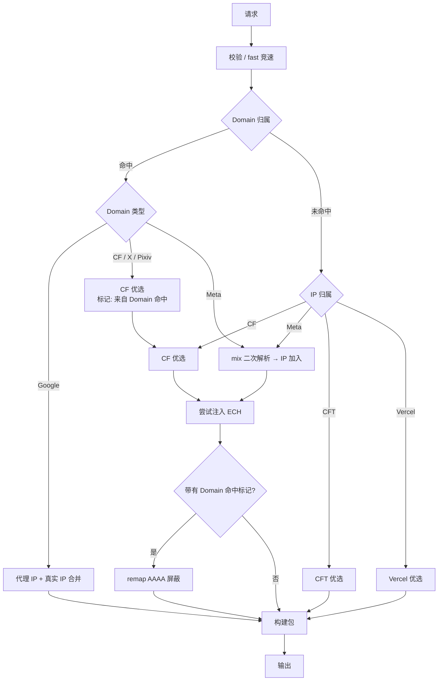

# SuperDoH-RS 需求文档(正式版)

> 版本:v0.1(2026-08-03,由需求草稿整理,全部决策已闭环)
> 前置资料:`docs/README.md`、`docs/DOCUMENTATION.md`、`docs/KNOWN_ISSUES.md`、`docs/META_ECH_HANDOFF.md`(原版资料副本)
> 决策记录:`docs/01-requirements.md`(含 Q1-Q28 逐条裁决历史)

---

## 1. 项目概述与技术栈

将原版 JS 版 SuperDoH(Cloudflare Workers DNS-over-HTTPS 代理)重写为 **Rust 为主** 的 SuperDoH-RS:

| 层 | 语言 | 说明 |
|---|---|---|
| Worker 本体(核心逻辑) | **Rust**(workers-rs / worker crate) | 严格按代码规范(`docs/00-coding-standards.md`) |
| 构建脚本 / 配置生成 | JS(Node) | 允许,宽松规范 |
| 前端 / 测试 | JS | 前端像素级复刻,零修改 |

## 2. 设计分层原则

1. **算法层**:`fast` / `mix` 是算法,不承载 CDN、Meta、ECH、过滤等业务策略
2. **策略层**:Domain/IP 归属、优选、IP 加入、ECH、remap AAAA 属于策略
3. **协议/实现层**:DNSSEC、EDNS、RCODE、wire format、TTL 边界、连接取消属协议/实现
4. 不因原版 JS 存在某个策略就默认新版必须继承
5. 协议正确性和 Rust 实现细节自行采用正确实现,不再逐项确认
6. 只有改变实际产品行为或已确认优化策略时,才提出需求问题

## 3. 全局原则:模仿正常 DNS 分发服务

本项目涉及对 DNS 结果的修改操作(替换 IP / 注入 ECH / 移除 AAAA 等),整个服务必须表现得像一个**正常的、标准的 DNS 分发服务**——协议行为、响应格式、错误语义均符合标准 DNS/DoH 规范,不暴露代理/优化痕迹:

- DNS wire format 正确性(RFC 8484),响应结构规范
- 标准状态码与 RCODE 语义(NODATA / NXDOMAIN / SERVFAIL + EDE)
- **生产 DoH 响应不通过公开响应头暴露内部优化路径**(request id、耗时、上游等诊断信息只进结构化日志;正常响应保持统一外部行为)
- TTL 合理性、EDNS/DO 位处理符合正常解析器行为

---

## 4. 统一编排流程

### 4.1 流程图

### 4.2 统一编排语义(Q11 裁决)

"所有 QTYPE 一样的流程"指**统一编排流程**,不代表把同一种 RDATA 修改方式硬套给所有类型。按 QTYPE 正确处理 wire format:

- **A**:处理 A 记录
- **AAAA**:处理 AAAA 记录
- **HTTPS(65)**:处理 HTTPS RR 内可修改的字段(hints / ECH)
- **其他 QTYPE**:仍经过统一流程,没有适用优化动作时自然 **no-op**

不要因类型不同拆成完全独立的业务流程。

### 4.3 流程要点

1. **Domain 归属优先于 IP 归属**:域名命中规则(remap 列表 / Google 代理规则 / Meta 域名规则)时不再做 IP 分类
2. **Domain 命中的 CF/X/Pixiv**(remap)→ CF 优选 + 打"来自 Domain 命中"标记
3. **Domain 未命中** → 按响应 IP 归属分类:CF → CF 优选;Meta → mix 二次解析后 IP 加入;CFT → 优选;Vercel → Vercel 优选
4. **ECH 注入**:走到"尝试注入 ECH"节点即尝试——响应里有 HTTPS(65)记录就注入,没有就跳过(Q2);是否执行取决于对应策略是否有 ECH 来源(CF 动态 / Meta 静态),不是所有 owner 都强行注入(Q21)
5. **remap AAAA 屏蔽**:带有"来自 Domain 命中"标记的 AAAA,最终语义必须 NODATA(Q14)
6. Google → 代理 IP + 真实 IP 合并,不经过 ECH
7. 所有路径汇聚 → 构建包 → 输出

### 4.4 无地区配置路径(Q9)

configured:0 / regions 为空 / 非 CN 地区:fast 竞速后**直接返回**,不做归属/优选/ECH 优化。

---

## 5. 算法层

### 5.1 fast(竞速)

- **语义**:并发查询多个上游,**先回有效者胜**(原 AUTO 1 竞速重新设计)
- **硬超时**:200ms(可配置;Q5)
- **三态验证**(Q12):区分 `positive / negative / invalid`
  - 首个语义完整 **positive** 立即胜出
  - 标准 **negative** 可暂存,最终无 positive 时返回最早有效 negative
  - 这是通用响应有效性处理,不是 ECS 保护窗
- **通用验收回调**(Q16):fast 提供 `accept/validator` 回调接口——算法层不硬编码 CF/Meta/ECH 等业务知识,具体验收条件由调用方(策略层)提供
- **调用点**:
  - 主查询(第 4 节流程入口)
  - 优选域名解析(CF/CFT/Vercel 优选节点)
  - CF ECH 获取(cloudflare-ech.com HTTPS RR 查询)
- **ECS/EDNS**:不区分优先级;仅 `ecs:true` 上游携带 ECS(Q23 按 RFC 正确实现)

### 5.2 mix(收集)

- **语义**:向多个 DNS 厂商(上游)发送请求,收集所有返回结果并**合并去重**,获取尽可能多的 IP
- **纯算法边界**(Q18):mix 只做 **并发查询 → 收集 → 合并 → 去重**;不知道 Meta、CF、blockedCidrs,不知道调用前后流程。family、blockedCidrs、owner 等业务检查由**调用 mix 的策略层负责,绝不能写进 mix 算法本身**
- **硬超时**:200ms(与 fast 一致,可配置)
- **无固定 IP 数量上限**(Q25):算法内部不设上限;最终 DNS 构包保证合法 wire size(65535),消息大小边界内安全裁剪属构包实现问题
- **调用点**:Meta IP 归属确认后的二次解析(策略层,见 6.4)
- **查询类型**:跟随原请求类型(A 查 A、AAAA 查 AAAA;A/AAAA 对等支持,Q20)

### 5.3 连接管理(实现要求,Q24)

winner/deadline 后及时取消 loser(显式 AbortSignal),遵守 Worker 并发连接限制。

---

## 6. 策略层

### 6.1 Domain 归属

| 规则 | 对应原版 | 命中后 |
|---|---|---|
| remap 列表(CF/X/Pixiv 等) | `isCFDomain` | CF 优选 + 打"来自 Domain 命中"标记 |
| Google 代理规则(Cealing-Host) | `matchGoogleProxy` | 代理 IP + 真实 IP 合并 |
| Meta 域名列表 | `isMetaDomain` | Meta 策略(进 6.4) |

Domain 分类补齐 Meta(Q21):Domain 命中 Meta 时进入 Meta 策略,不应因为 HTTPS 没有普通 A/AAAA Answer 就无法识别 Meta。

### 6.2 IP 归属(GeoIP)

按响应 IP 归属分类(CF / Meta / CFT / Vercel / 其他)。**混合 owner 或无法明确 owner 时,默认不做基于 IP owner 的整体替换**(Q17);Domain 明确命中的强制规则不受此限制。

HTTPS(65) 响应没有普通 A/AAAA Answer 时,可直接使用其 ServiceMode `ipv4hint` / `ipv6hint` 作为响应内 IP 归属依据(Q11/Q19);AliasMode、无 hints、混合 owner 或无法明确归属时不做基于 IP owner 的自动分类,不额外引入 side A/AAAA 探测。

### 6.3 优选替换(CF / CFT / Vercel)

- 用 **fast** 解析优选域名(`preferredCf` / `preferredCft` / `preferredVrc`)
- **替换语义**:优选解析得到的 IP **替换**原先解析结果中的 IP(不是追加/合并);TTL 60(Q27)
- 验收条件(expectedOwner 等)由调用方通过 fast 的 accept 回调提供(Q16)

### 6.4 Meta(mix 二次解析)

- 流程:IP 归属判定为 Meta(或 Domain 命中 Meta)→ **mix 二次解析** → IP 加入
- mix 结果与 **Meta 静态路由表**(meta-route.js)合并(Q8;合并顺序/去重为实现细节)
- **Meta AAAA 正常增强**(Q20):A → mix A 收集 IPv4;AAAA → mix AAAA 收集 IPv6;不沿用原版"Meta AAAA NODATA"限制
- TTL:300(Q27)
- 业务过滤(如 owner / blockedCidrs 检查)由策略层在 IP 加入前执行(Q18)

### 6.5 Google(代理 + fallback)

- **合并 + Happy Eyeballs**:Cealing-Host 代理 IP 优先 + 真实 IP 兜底合并(Q4)
- 代理 IP 排前只作为 **best-effort**,不承诺客户端一定按 RR wire 顺序连接(Q26)

### 6.6 ECH 注入

| 来源 | 说明 |
|---|---|
| CF 动态 | `cloudflare-ech.com` HTTPS RR 查询(用 fast);缓存 10min + 1h stale 兜底(Q10 #9),失效策略可配置(Q22) |
| Meta 静态 | 独立策略配置;ECHConfig 与域名的映射做成**可配置/可维护数据,不写死进通用算法**(Q22) |

- HTTPS RR 按 DNS/SVCB/HTTPS 规范正确处理 AliasMode、ServiceMode、mandatory、hints、ECH;**不允许为了优化生成非法 RR**;无法安全修改时 no-op / 保留原数据(Q19)
- 当地区 A/AAAA 地址策略会改变实际连接目标时,HTTPS ServiceMode 中对应的 `ipv4hint` / `ipv6hint` 必须同步重写或移除,避免客户端绕过优选或 remap AAAA 屏蔽。当前实现选择**移除对应 hints 并同步维护 mandatory**,让客户端回到既有 A/AAAA 优化路径,不为 HTTPS 额外增加 side A/AAAA lookup(Q19/Q24)
- 走到注入节点即尝试:有 HTTPS 记录就注入,没有就跳过(Q2)

### 6.7 remap AAAA 屏蔽(Q14)

remap Domain 命中的 AAAA **最终语义必须 NODATA**。如果"构建前删除 AAAA"会因 CNAME 链产生绕过,实现允许改为更早短路。保持产品语义,不强制代码执行位置。

### 6.8 Chrome DoH canary

`use-application-dns.net` A/AAAA 查询返回 NXDOMAIN(Q8 保留)。

---

## 7. 协议层要求

### 7.1 DNSSEC(Q13)

- **DNSSEC 必须协议兼容**,不能因客户端请求 DNSSEC 就直接绕过整个优化流程
- 正确支持 DO/CD/AD/OPT、DNSKEY、DS、RRSIG、NSEC/NSEC3 等 DNSSEC 数据和状态语义
- SuperDoH 是 **DNSSEC-aware / DNSSEC-preserving proxy**,不是递归 DNSSEC 验证器;密码学验证由可信递归上游负责
- 未修改的数据正常保留上游 DNSSEC 数据及 AD 状态
- 被修改/替换/合成的 RRset:删除对应无效 RRSIG,清除不能再成立的 AD 状态,**不伪造 Secure**
- 不要求也不允许在没有目标 Zone 私钥的情况下为修改后的第三方 RRset 重新签名

### 7.2 EDNS / ECS(Q23)

按 RFC 正确实现:避免重复 ECS、不扩大客户端主动提供的前缀、正确处理 /0。请求自带 ECS 时不重复注入。

### 7.3 RCODE 与负响应(Q12 / Q15)

- fast 区分 positive / negative / invalid;负响应可暂存兜底
- **NXDOMAIN/NODATA 不得因为 Domain 命中、mix 或静态 IP 被"复活"**;只有主查询存在可优化的正答案时才继续优化

### 7.4 TTL(Q27)

已确认策略 TTL:**mix 300,preferred 60**(不因 review 改变)。实现层可在不改变策略上限的前提下,规范处理明显超出源数据有效期的异常缓存行为。

### 7.5 响应构建(Q25 / Q28)

- 最终 DNS 构包保证合法 wire size(65535);超限按完整 RR 边界裁剪并设 TC 或回退
- 生产响应不暴露内部优化路径(响应头统一外部行为)

---

## 8. 配置与构建

### 8.1 配置源(R2)

- 仓库根目录 `superdoh.config.js`(JS 格式 `export default`,唯一人类可编辑源)
- 构建流程:`npm run build`(构建脚本)→ 读取配置 → 生成 **Rust 版 config**(对应原版 `src/config.js` → `src/config.rs`)
- 构建时远程抓取:GeoIP CIDR(8 类)、Cealing-Host Google 代理列表
- `configured: 0/1` 双模式语义保留(0=首次配置模式,1=正式运行)

### 8.2 参数表(Q10 裁决)

| # | 参数 | 结论 |
|---|---|---|
| 1 | fast 并发上游数 | **与 #2 合并**为一个参数(如沿用 `autoConcurrency`,默认 6) |
| 2 | mix 并发上游数 | 同上,fast/mix 共用 |
| 3 | mix IP 上限 | **无限制**(去重全保留;metaMaxIps 废弃) |
| 4 | mix 结果 TTL | 300 |
| 5 | 优选替换 TTL | 60 |
| 6 | IP 黑名单 blockedCidrs | 保留 |
| 7 | ECS 前缀 | 24 / 56 |
| 8 | 超时后返回 | SERVFAIL + EDE 22 |
| 9 | CF ECH 缓存 | 10min + 1h stale |
| 10 | 日志 | logLevel 结构化 JSON |
| 11 | configured:0 默认上游 | google + cloudflare_Public |
| 12 | mix 查询类型 | 跟随原请求类型 |

**全局原则:所有参数均可配置(可调),不硬编码。**

### 8.3 前端字段兼容(Q1)

config-wizard.js 固定生成的全部字段(`autoConcurrency`、`ecsProtectMs`、`hardTimeoutMs`、`metaHardTimeoutMs`、`metaCollectWindowMs`、`metaMaxIps`、`preferredTimeoutMs`)在配置中**原样保留**(即使部分在新版流程中已无实际作用);`/config.json` 按前端契约返回全字段。前端零改动。

---

## 9. 前端(R1)

- 原项目 `frontend/`(index.html、en.html、css/style.css、js/resolver.js、js/config-wizard.js)**逐字节复用,零修改**
- 构建时打包进 Worker(替代 JS 版 `src/templates.js` 内嵌机制)
- 首页动态注入逻辑保留(`__HOST__`、`__UPSTREAM_LIST__`、`__CONFIGURED_VALUE__` 等占位符替换),在 Rust 侧实现
- 配置向导(config-wizard.js)为纯浏览器端逻辑,直接复用

## 10. 端点(Q8)

| 端点 | 保留 | 说明 |
|---|---|---|
| `/dns-query` | ✅ | 唯一 DoH 端点(fast 模式;单上游端点已删除) |
| `/:provider/dns-query` | ❌ | **删除** |
| `/health` | ✅ | 健康检查 |
| `/config.json` | ✅ | 当前生效配置(前端向导契约) |
| 伪装入口(ENTRANCE+PROXY) | ✅ | 反向代理伪装 |
| Chrome canary | ✅ | use-application-dns.net → NXDOMAIN |

---

## 11. 与原版实现对应关系

| 新版组件 | 原版实现 |
|---|---|
| fast 竞速 | `concurrentAll`(去 ECS 保护窗,200ms) |
| mix 收集 | `metaResolve` 收集窗 + `resolvePreferred` 收集语义 |
| Domain 归属 | `isCFDomain`(remap)/ `isMetaDomain` / `matchGoogleProxy` |
| IP 归属 | `classifyResponse` / `detectOwner`(GeoIP CIDR) |
| CF/CFT/Vercel 优选 | `preferredAnswer`(解析优选域名,替换,T TL 60) |
| Meta IP 加入 | `metaResolve`(静态路由 + 收集)→ 新版 mix 二次解析 + 静态路由合并 |
| ECH 注入 | `injectECH`(CF 动态 / Meta 静态) |
| remap AAAA 屏蔽 | 原版入口拦截 NODATA(语义保留,位置自由) |
| canary | 原版 NXDOMAIN |

---

## 12. 待办(实现层,不在需求裁决范围)

- 构建脚本 `build-config`(superdoh.config.js → src/config.rs)实现
- fast/mix 算法实现与 accept 回调接口设计
- DNSSEC / EDNS / ECS / wire format 协议正确性(Rust 实现细节,自行采用正确实现)
- 连接管理(winner abort losers、6 连接限制、subrequest 上限)
- 构包:65535 wire-size 硬限制、TTL 规范化、负响应 SOA 附注
- ECHConfig 与域名映射的可配置数据结构(Meta 静态 ECH)
- 测试:纯逻辑宿主 `#[test]` + wasm 测试 + miniflare E2E

---

*文档状态:正式版 v0.1,需求决策全部闭环。后续变更走"需求问题"流程(仅当改变实际产品行为或已确认优化策略时)。*
